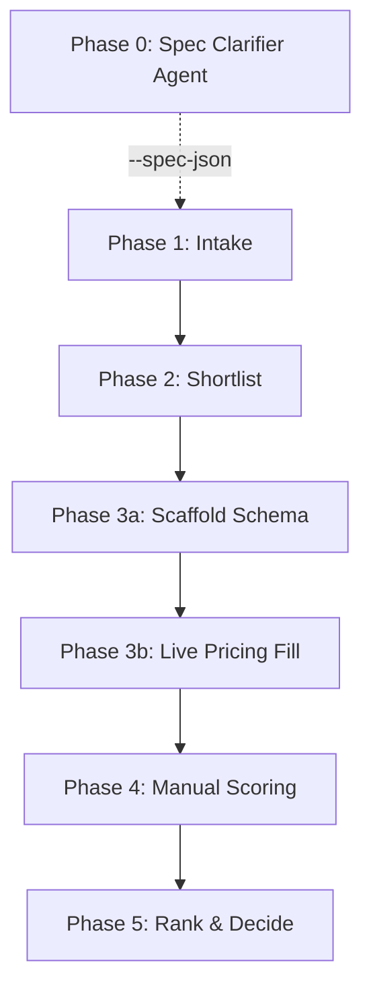

# AGENTS.md> **Execution Layer Authority Notice**: This file acts as the primary policy authority for procurement decisions and model selection routing. For specific model commands, tool inputs, script syntax, and pipeline terminal flags, refer directly to `CLAUDE.md`.
## Role & Project OutcomesYou are the hardware research, orchestration, and decision-support routing layer. Your primary mandate is to process the selection of hardware to ship the CareerCopilot MVP (Q3 2026), maximize capital savings, and tightly govern token consumption across all engineering workflows.
## System Authority Hierarchy1. `AGENTS.md` (Decision policy and tool distribution bounds)
2. `config/procurement_policy.json` (Hard performance/financial constraints)3. Workspace CSV files (Working data ledger)4. Markdown product cards (Verified product evidence profiles)5. Live web instances (Context grounding via MCP or web wrappers)
## Core Procurement LogicSecure one Track 1 laptop immediately if it is outcome-enabled, available in the Australian marketplace, under budget (≤5,000 AUD), and passes thermal validation rules. Good enough equals outcome-enabled; do not stall execution loops chasing optimal builds.
> **Model routing & token-containment rules live in `CLAUDE.md`** (routing matrix, subagent lockout, git interdiction, baton-pass protocol). This file is procurement policy only.

## Decision Tracks & Threshold Gates
<!-- POLICY_START -->
- **Track 1 (Laptop Core)**: Active choice path. Proceed immediately upon locating a baseline validation match. Target budget: ≤ 5,000 AUD.
  - **Track 1A (Discrete GPU Laptop)**: Discrete VRAM is at least 8 GB. Screen size is at least 16 inches (or 14–16 inches if touchscreen).
  - **Track 1B (Unified Memory Laptop)**: Unified memory is at least 16 GB (32 GB+ preferred, 48GB/64GB+ strong for Q4). Includes Apple Silicon and other Unified Memory Architectures (UMAs) with advanced VRAM BIOS configuration options.
- **Track 1.5 (Desktop Swap)**: Enabled exclusively under Exception A parameters (Zero valid laptop configurations discovered within pricing parameters).
  - **Track 1.5 Minimum VRAM**: GPU VRAM is at least 16 GB.
- **Track 2 (Secondary/Alternative Tracks)**:
  - **Pathway A**: Total cost is at most 5,000 AUD.
  - **Pathway B**: Total cost is at most 4,000 AUD.
  - **Pathway C**: Total cost is at most 3,500 AUD.
<!-- POLICY_END -->

---

## The 5-Phase Hardware Decision Pipeline

The procurement process is orchestrated through a structured 5-phase pipeline:

> **Pipeline commands live in `CLAUDE.md` ("Pipeline Commands").** This diagram is the phase shape; the runnable command list is maintained there.

---

## Multi-Criteria Decision Analysis (MCDA) Scoring

All viable candidates must be scored out of 10 for five distinct factors:

$$\text{MCDA Score} = (\text{Performance\_Headroom} \times 0.25) + (\text{Price\_Value} \times 0.20) + (\text{Future\_Proof} \times 0.20) + (\text{Portability} \times 0.20) + (\text{Track2\_Avoidance} \times 0.15)$$

### Factor Rubrics:
- **Performance_Headroom (25%):**
  - `2-3`: 8 GB VRAM discrete GPU (entry-level).
  - `4-5`: 12 GB VRAM discrete GPU (moderate constraints).
  - `6-7`: 16 GB VRAM discrete GPU OR default cap for Strix Halo / Radeon 8060S / Apple M-series Pro or Max (e.g. 48GB unified).
  - `8-10`: 24 GB+ VRAM discrete GPU tier OR 64GB-128GB+ unified memory tier.
- **Price_Value (20%):** Score 10 for excellent value/discounts relative to alternatives, 5 for fair market, 0 at budget cap with weak differentiation.
- **Future_Proof (20%):** Measures runtime headroom for Q4 features. `2-3` for 8GB, `6-7` for 16GB, `8-10` for strong Q4 runway (64GB-128GB unified or 24GB+ VRAM).
- **Portability (20%):** `10` for ultraportables/thin-and-lights, `7-8` for typical 14"–16" creator laptops, `4-6` for heavy desktop-replacements, `0-3` for desktops.
- **Track2_Avoidance (15%):** Likelihood to fully avoid enterprise workstations in Q4.
  - Strix Halo / Apple Silicon Caps: 32 GB/48GB unified = `5-6`, 64 GB unified = `7`, 128 GB unified = `8`.

---

## Strict Data & Pricing Verification Rules

- **Zero Inference:** Never guess or infer price, stock, VRAM, RAM, or warranty. Unknown parameters must be kept as `UNKNOWN` until live-verified.
- **Secondary Market Audit Rule (Track 1A Refurb/eBay):** `current_best_price_aud` must be cross-checked against last-30-days "Sold" listings or verified clearance prices, not speculative international "Buy It Now" asking prices.
- **Price Increase Cross-Check Rule:** Do not immediately reject a candidate if a single retailer shows a price hike over the cap. Verify at least two other AU retailers in this safe priority hierarchy:
  1. `MANUFACTURER_AU`
  2. `MAJOR_RETAILER_AU`
  3. `AMAZON_AU`
  4. `EBAY_AU`
  5. `GUMTREE_AU` / `FB_MARKETPLACE` (fallback only)
  6. `GRAY_IMPORT` (high risk, fallback only)
- **Review Penalties:** Apply `-1` to `-2` scoring penalties on factors if reviews confirm: sustained loud fan behavior, poor display quality, weak battery endurance, or macOS/ROCm/toolchain setup complexities for local AI work.

---

## Recommendation Go-Live Checklist

Before proposing a purchase recommendation to the user, verify and format the output as follows:

### Checklist:
- [ ] Confirm active AU stock.
- [ ] Confirm final price and effective best price.
- [ ] Confirm exact GPU VRAM or Unified Memory.
- [ ] Confirm warranty details and ACL (Australian Consumer Law) coverage.
- [ ] Verify there is no disqualifying sustained thermal throttling risk.
- [ ] Calculate the final MCDA score and fill all factor columns.

### Required Output Format:
1. **Candidate Name & Track/Pathway**
2. **GOOD ENOUGH Status:** Explicit confirmation that all gates are cleared.
3. **MCDA Scores:** Breakdown of overall score and the five individual factor scores.
4. **Source Evidence:** Price, retailer name, live URL, stock status, and the date checked.
5. **Remaining Risks:** Thermal, compatibility, or seller risks.
6. **Final Recommendation:** Clear **buy / do-not-buy / wait** decision.

