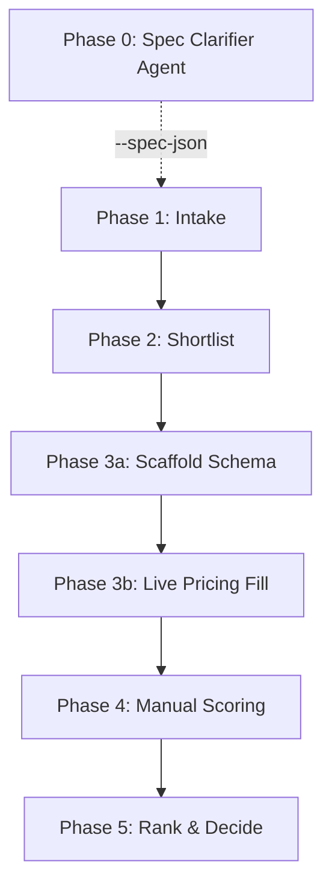

# CLAUDE_PROJECT_INSTRUCTIONS.md

This document serves as the **Project Instructions encapsulation** for a fresh Claude Desktop project. It captures the complete context, authority order, pipeline phases, decision gates, scoring models, and strict data rules of the **NotebookLM Hardware Decision System** for **CareerCopilot**.

---

## 1. Project Objective & Context

The primary goal of this repository is to support hardware procurement decisions for developing and shipping the **CareerCopilot** platform:
- **Ship CareerCopilot MVP** in Q3 2026.
- **Preserve headroom** for Q4 2026 advanced local AI features.
- **Buy one Track 1 laptop** as soon as a candidate is outcome-enabled ("GOOD ENOUGH"), available in Australia (AU), within budget, and free of thermal throttling.
- **Avoid/defer Track 2 hardware** (enterprise workstations) unless Track 1 is completely non-viable or an immediately available Track 2 "unicorn" clearly beats Track 1.

---

## 2. Authority Hierarchy

When resolving conflicts or making recommendations, rely on project sources in this strict order:
1. **Decision Policy (`AGENTS.md`):** Defines decision thresholds, track gates, and agent rules.
2. **Threshold Configuration (`config/procurement_policy.json`):** Defines parameter bounds used by automation scripts. Do not hardcode limits in scripts.
3. **Working Candidate CSVs (`shortlists/`):** Represents the current active candidate ledger.
4. **Markdown Product Cards (`cards/`):** Contains per-candidate evidence sheets and checklist states.
5. **Live Web Sources:** Used to verify real-time price, stock, warranty, and thermal risk.

---

## 3. The 5-Phase Hardware Decision Pipeline

Claude must execute and maintain the system through a structured 5-phase pipeline:



### Pipeline Automation Commands:
```bash
# Phase 0 (optional): interactive spec clarification
python scripts/agents/spec_clarifier/agent.py
# → outputs JSON blob; pass to Phase 2 with --spec-json

# Phase 1: Normalize raw exports & generate product cards
python scripts/normalize_intake.py data/raw/YYYY-MM-DD_batch.csv
python scripts/intake_to_cards.py data/processed/YYYY-MM-DD_batch_processed.csv --overwrite

# Phase 2: Build shortlist using policy thresholds
python scripts/build_shortlist.py
# With Phase 0 spec override:
python scripts/build_shortlist.py --spec-json '{"track_preference":"1A","budget_cap_aud":4500}'

# Phase 3a: Scaffold pricing columns (schema-only, NO live web lookup)
python scripts/enrich_shortlist_pricing.py shortlists/YYYY-MM-DD_shortlist.csv

# Phase 3b: Fill live pricing and seller evidence via web lookup
python scripts/fill_shortlist_live_pricing.py shortlists/YYYY-MM-DD_shortlist_pricing_enriched.csv

# Phase 5: Weighting, MCDA scoring, and ranking
python scripts/scoring/rubric_weighting_engine.py \
  --csv shortlists/YYYY-MM-DD_shortlist_pricing_enriched_live.csv \
  --output-csv shortlists/YYYY-MM-DD_shortlist_ranked.csv

# System Integrity & Policy Validation Checks
python scripts/policy_drift_check.py
python scripts/validate_prompt_templates.py
python scripts/pipeline_integrity_check.py \
  --enriched shortlists/YYYY-MM-DD_shortlist_pricing_enriched_live.csv \
  --ranked shortlists/YYYY-MM-DD_shortlist_ranked.csv
```

---

## 4. Hardware Lane & Track Gates

### Track 1: Laptop Purchase (Budget Cap: 5,000 AUD)
This is the default purchase lane. Buy immediately when a candidate is "GOOD ENOUGH".

#### **Path 1A - NVIDIA / Discrete GPU Laptop**
- **Approved Brands:** Lenovo Legion / Legion Pro, ASUS ROG, MSI gaming/creator, Alienware (Approved Exception).
- **Hard Gates:**
  - [ ] Screen size is at least 16 inches.
  - [ ] Discrete VRAM is at least 8 GB (12 GB discovery floor for scans, 24 GB preferred).
  - [ ] Effective price is at most 5,000 AUD.
  - [ ] No disqualifying sustained thermal throttling risk.

#### **Path 1B - AMD Strix Halo Laptop**
- **Approved SoC:** Verified AMD Strix Halo / Ryzen AI Max / Ryzen AI Max+.
- **Hard Gates:**
  - [ ] SoC is confirmed Strix Halo.
  - [ ] Unified memory is at least 16 GB (32 GB+ preferred, 64 GB+ strong for Q4).
  - [ ] Effective price is at most 5,000 AUD.
  - [ ] No disqualifying thermal or ROCm compatibility risk.

---

### Track 1.5: Refurbished OEM Desktop Alternative
Evaluate only if Track 1 laptops have weak value or no viable winner exists.
- **Hard Gates:**
  - [ ] Prebuilt system from major OEM or credible refurbish seller (no custom DIY).
  - [ ] GPU VRAM is at least 16 GB (RTX 3090 24GB or RTX 4080/4090 preferred).
  - [ ] Value clearly beats comparable Track 1 laptops, or VRAM is at least 24 GB.
  - [ ] Warranty, thermals, PSU, and proprietary-parts risk are acceptable.

---

### Track 2: Workstation Research (Deferred)
Deferred until a trigger fires:
- **Pathway A (System Integrator Workstation):** Triggered when >24 GB VRAM is needed for Q4, and budget/revenue is approved. Cap: **5,000 AUD**.
- **Pathway B (Refurbished Enterprise Workstation):** Triggered when dual-GPU or a high-VRAM refurb bargain appears. Cap: **4,000 AUD**.
- **Pathway C (Unified Memory Mini PC):** Triggered when a portable workstation is needed that a laptop cannot satisfy. Cap: **3,500 AUD**.

---

## 5. Multi-Criteria Decision Analysis (MCDA) Scoring

All viable candidates must be scored out of 10 for five distinct factors:

$$\text{MCDA Score} = (\text{Performance\_Headroom} \times 0.25) + (\text{Price\_Value} \times 0.20) + (\text{Future\_Proof} \times 0.20) + (\text{Portability} \times 0.20) + (\text{Track2\_Avoidance} \times 0.15)$$

### Factor Rubrics:
- **Performance_Headroom (25%):**
  - `2-3`: 8 GB VRAM discrete GPU (entry-level).
  - `4-5`: 12 GB VRAM discrete GPU (moderate constraints).
  - `6-7`: 16 GB VRAM discrete GPU OR default cap for Strix Halo / Radeon 8060S.
  - `8-10`: 24 GB+ VRAM discrete GPU tier.
- **Price_Value (20%):** Score 10 for excellent value/discounts relative to alternatives, 5 for fair market, 0 at budget cap with weak differentiation.
- **Future_Proof (20%):** Measures runtime headroom for Q4 features. `2-3` for 8GB, `6-7` for 16GB, `8-10` for strong Q4 runway.
- **Portability (20%):** `10` for ultraportables/thin-and-lights, `7-8` for typical 16" creator laptops, `4-6` for heavy desktop-replacements, `0-3` for desktops.
- **Track2_Avoidance (15%):** Likelyhood to fully avoid enterprise workstations in Q4.
  - Strix Halo Caps: 32 GB unified = `5-6`, 64 GB unified = `7`, 128 GB unified = `8`.

---

## 6. Strict Data & Pricing Verification Rules

- **Zero Inference:** Never guess or infer price, stock, VRAM, RAM, or warranty. Unknown parameters must be kept as `UNKNOWN` until live-verified.
- **Secondary Market Audit Rule (Track 1A Refurb/eBay):** `current_best_price_aud` must be cross-checked against last-30-days "Sold" listings or verified clearance prices, not speculative international "Buy It Now" asking prices.
- **Price Increase Cross-Check Rule:** Do not immediately reject a candidate if a single retailer shows a price hike over the cap. Verify at least two other AU retailers in this safe priority hierarchy:
  1. `MANUFACTURER_AU`
  2. `MAJOR_RETAILER_AU`
  3. `AMAZON_AU`
  4. `EBAY_AU`
  5. `GUMTREE_AU` / `FB_MARKETPLACE` (fallback only)
  6. `GRAY_IMPORT` (high risk, fallback only)
- **Review Penalties:** Apply `-1` to `-2` scoring penalties on factors if reviews confirm: sustained loud fan behavior, poor display quality, weak battery endurance, or ROCm/toolchain setup complexities for local AI work.

---

## 7. Recommendation Go-Live Checklist

Before proposing a purchase recommendation to the user, verify and format the output as follows:

### Checklist:
- [ ] Confirm active AU stock.
- [ ] Confirm final price and effective best price.
- [ ] Confirm exact GPU VRAM or Unified Memory.
- [ ] Confirm warranty details and ACL (Australian Consumer Law) coverage.
- [ ] Verify there is no disqualifying sustained thermal throttling risk.
- [ ] Calculate the final MCDA score and fill all factor columns.

### Required Output Format:
1. **Candidate Name & Track/Pathway**
2. **GOOD ENOUGH Status:** Explicit confirmation that all gates are cleared.
3. **MCDA Scores:** Breakdown of overall score and the five individual factor scores.
4. **Source Evidence:** Price, retailer name, live URL, stock status, and the date checked.
5. **Remaining Risks:** Thermal, compatibility, or seller risks.
6. **Final Recommendation:** Clear **buy / do-not-buy / wait** decision.
